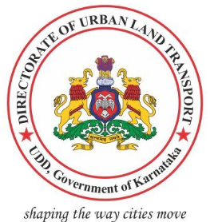
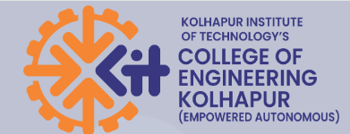
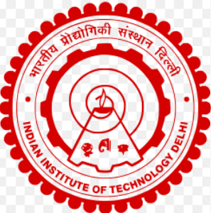
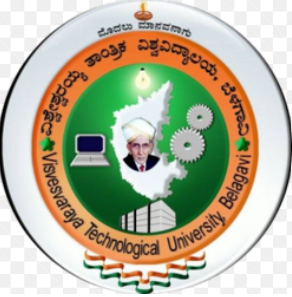

---
hide:
  - toc
  - navigation
---

# Experience & Education

## Work Experience

<h3>Post Doctoral Research Associate-III — CiSTUP, IISc Bangalore</h3>

<em>Nov 2024 – May 2026 | Bangalore, India</em>

<ul>
<li>Designed and executed large-scale travel behavior surveys, ensuring methodological rigor and high-quality data collection across multiple locations.</li>
<li>Developed automated R and Python scripts for data validation, consistency checks, and preprocessing, enabling reliable downstream econometric and behavioral analysis.</li>
<li>Applied advanced QGIS techniques to geocode survey responses, strategically map survey locations, and generate spatial visualizations to support survey planning and empirical analysis.</li>
<li>Project report writing, communication and co-ordination to generate and business plans.</li>
</ul>

<h3>Researcher — Nagoya University, Japan</h3>

<em>Jan 2024 – Jul 2024 | Nagoya, Japan</em>

<ul>
<li>Last mile EV charging behavior analysis.</li>
<li>Analyzed vehicle ownership patterns by engine capacity in Japan.</li>
<li>Data curation to reveal why and when people are likely to relinquish EV ownership.</li>
<li>Developed R and Python workflows for data cleaning, validation, and exploratory statistical analysis.</li>
</ul>

<h3>Associate Transport Planner — Directorate of Urban Land Transport (DULT), Bangalore</h3>

<em>Jun 2023 – Dec 2023 | Bangalore, India</em>

<ul>
<li>Led data-driven evaluation of BRTS implementation and urban bus service performance, identifying operational bottlenecks and reliability issues relevant to large-scale network optimization.</li>
<li>Contributed to city logistics planning and Comprehensive City Mobility Plans (CMPs) by integrating travel demand data, service performance indicators, and accessibility metrics.</li>
<li>Translated analytical findings into actionable policy recommendations by engaging with senior government officials.</li>
</ul>

<h3>Senior Associate Consultant, Transportation Systems — ITDP</h3>

<em>Mar 2022 – Oct 2022 | India</em>

<ul>
<li>Applied data analytics and AI-based techniques to review and synthesize public transport and informal transport (IPT) problem statements across 45 Indian cities.</li>
<li>Developed analytical frameworks to assess system performance, operational gaps, and electrification readiness across heterogeneous urban contexts.</li>
<li>Prepared technical reports on scaling electric three-wheeler systems, integrating operational data, demand patterns, and policy constraints.</li>
<li>Designed and executed IPT survey instruments to collect real-world data on e-rickshaw procurement, operational challenges, and adoption barriers.</li>
</ul>

<h3>Junior Research Fellow — Indian Institute of Science (IISc), Bangalore</h3>

<em>Sept 2015 – Jul 2016 | Bangalore, India</em>

<ul>
<li>Data collection of pedestrian behavior, traffic survey, and parking survey.</li>
<li>Data collection of pedestrian behavior dynamics towards a big data approach – Kumbh Mela Experiment.</li>
</ul>

<h3>Assistant Professor — Kolhapur Institute of Technology, Kolhapur</h3>

<em>Jan 2015 – Aug 2015 | Kolhapur, India</em>

<ul>
<li>Subjects taught: Transportation Engineering, Urban Transportation Systems, Urban and Regional Planning.</li>
</ul>

---

## Education

<h3>Ph.D. in Transportation Planning</h3>

<strong>Indian Institute of Technology (IIT) Delhi</strong> | <em>2017 – 2022</em>

Thesis: <em>A Study on the Effects of Built Environment Measures on Vehicle Ownership and Travel Behavior: The Context of Twin Cities India.</em>

<h3>M.Tech. in Transportation Engineering</h3>

<strong>Visvesvaraya Technological University (VTU), Belgaum</strong> | <em>2012 – 2014</em>

<h3>B.E. in Civil Engineering</h3>

<strong>Visvesvaraya Technological University (VTU), Belgaum</strong> | <em>2008 – 2012</em>

---

## Awards & Grants

- **2025** — 2nd Prize, 1st World Symposium on Sustainable Transport and Livability, IISc Bangalore.
- **2021** — SERB International Travel Grant, Department of Science and Technology, Government of India.
- **2020–2021** — Sumant Moolgaokar Research Award, TRIP-Center, IIT Delhi.
- **2017–2021** — Institutional Scholarship for Ph.D., Ministry of Human Resource Development, Government of India.
