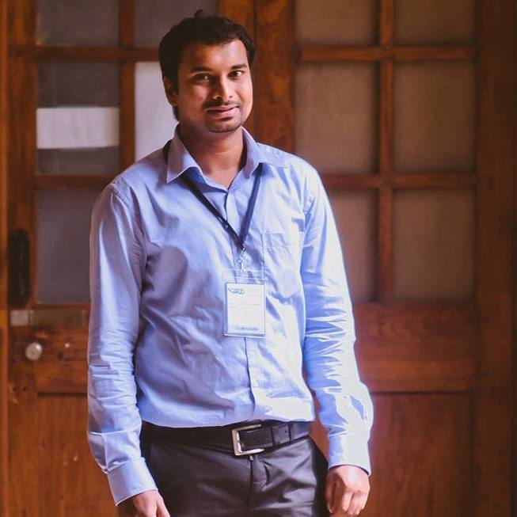
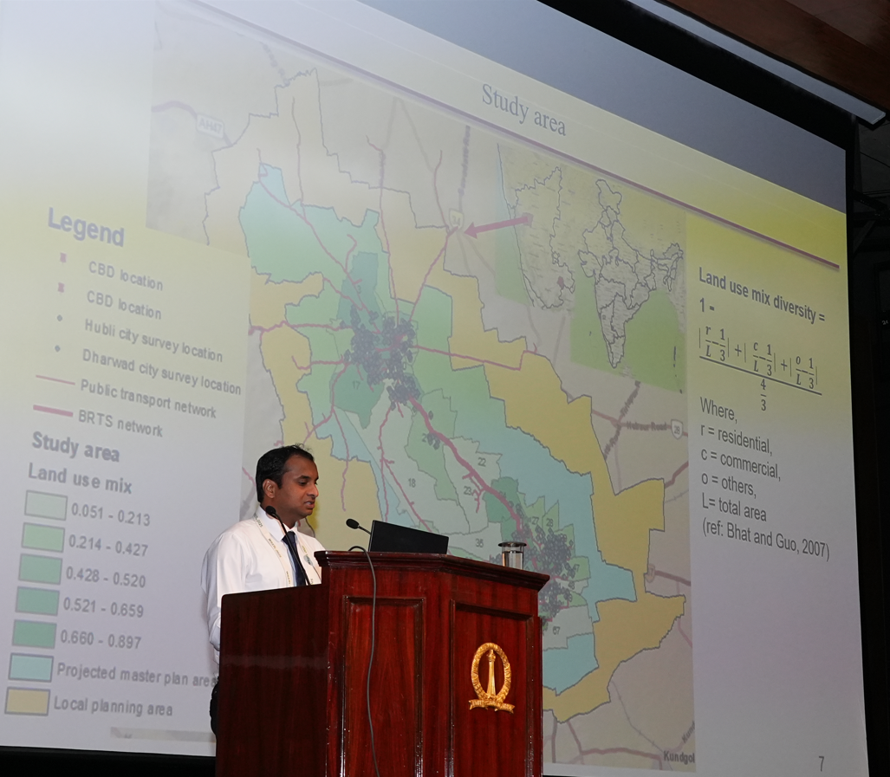

---
hide:
  - toc
  - navigation
---

  

    
  

  

    <h1 class="intro-name"><strong>Chetan Doddamani</strong></h1>
    

      Senior Data Analyst, WSP India 
      Previously: Post-Doctoral Researcher, CiSTUP, IISc Bangalore
    

    

      I am a Transportation Engineer and Planning Researcher with 8+ years of experience in travel demand modeling, public transit planning, and multi-modal travel patterns. I have published 8 journal articles and presented at 10 international conferences. Currently at IISc Bangalore, I work on large-scale real-world databases to forecast Bangalore city travel demand and understand the impact of infrastructure, fare, and economic development scenarios. I also use the International Classification of Activities for Time-Use Statistics (ICATUS) to model people's time investment across daily activities.
    

    

      <a href="https://github.com/chetandoddamani" target="_blank">GitHub</a> &nbsp;/&nbsp;
      <a href="https://www.linkedin.com/in/dr-chetan-doddamani-phd-9a742217/" target="_blank">LinkedIn</a> &nbsp;/&nbsp;
      <a href="https://scholar.google.co.in/citations?user=lHYaddMAAAAJ&hl=en" target="_blank">Google Scholar</a> &nbsp;/&nbsp;
      <a href="https://www.researchgate.net/profile/Chetan-Doddamani" target="_blank">ResearchGate</a> &nbsp;/&nbsp;
      <a href="assets/Chetan-CV.pdf" target="_blank">CV</a>
    

  

  
  
Presenting at an international conference

---

## Recent News

- **Jul 2026** — Enrolled in CCE course at IISc: *Foundational Mathematics for Generative AI* (May–Aug 2026)
- **Jun 2026** — Ongoing project: *Synthetic Daily Activity-Travel Schedule Generation Using India's Time Use Survey (TUS) 2024*
- **Nov 2024** — Joined CiSTUP, IISc Bangalore as Post-Doctoral Researcher
- **Jan 2024** — Visiting Researcher at Nagoya University, Japan (Jan–Jul 2024)
- **Jun 2023** — Consultant at DULT, Government of Karnataka
- **Mar 2022** — Senior Program Associate at ITDP India
- **2022** — Completed PhD in Transportation Engineering from IIT Delhi

---

## Research Interests

Transportation Planning &nbsp;·&nbsp; Travel Behavior Analysis &nbsp;·&nbsp; Activity-Based Demand Modelling &nbsp;·&nbsp; Multi-Modal Travel Patterns &nbsp;·&nbsp; Vehicle Ownership &nbsp;·&nbsp; Residential Mobility &nbsp;·&nbsp; GIS &amp; Remote Sensing &nbsp;·&nbsp; Statistical &amp; Econometric Modelling &nbsp;·&nbsp; Python &nbsp;·&nbsp; R

---

## Education

| Degree | Institution | Field | Year |
|--------|-------------|-------|------|
| Ph.D. | IIT Delhi, New Delhi | Transportation Engineering | 2017–2022 |
| M.Tech. | VTU, Belgaum | Transportation Engineering | 2012–2014 |
| B.E. | VTU, Belgaum | Civil Engineering | 2008–2012 |
